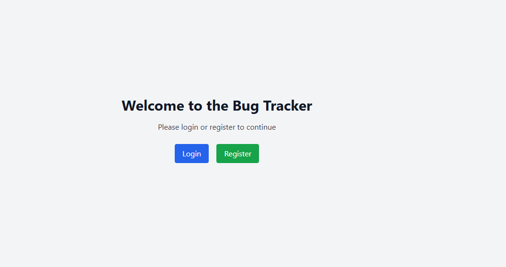
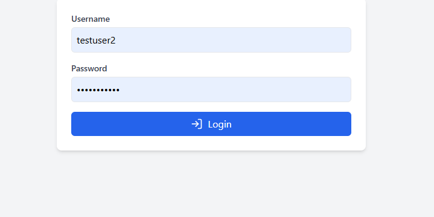
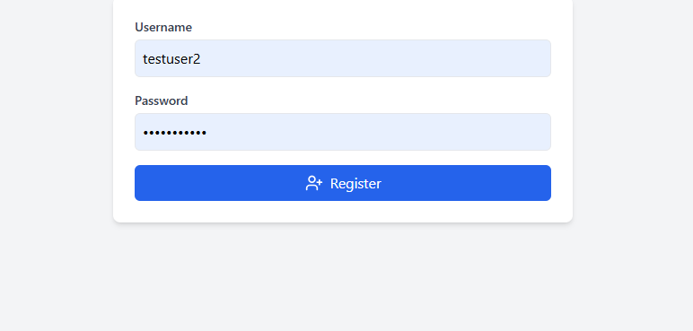
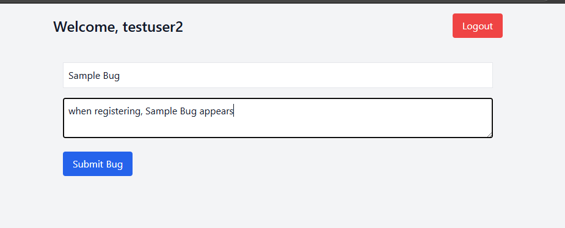
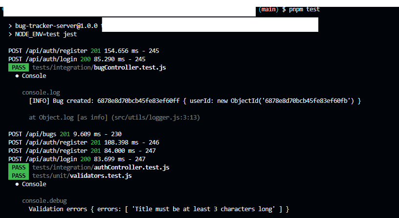
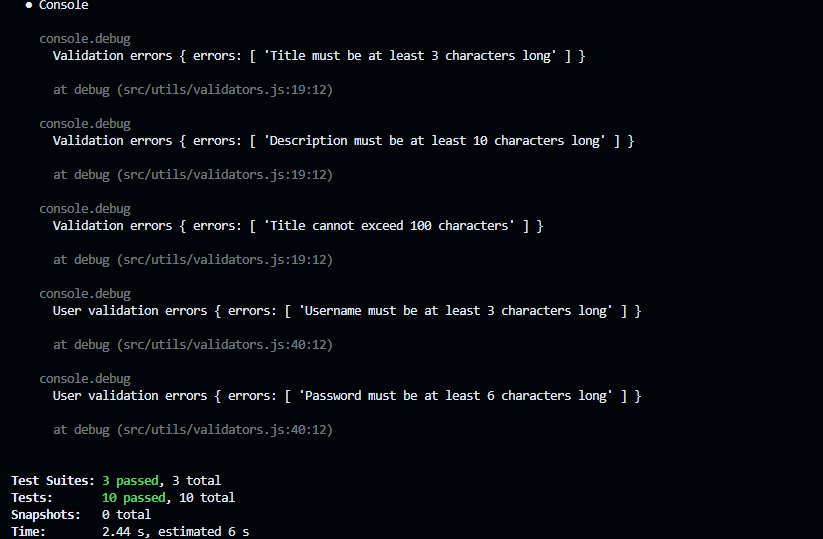

# 🐞 MERN Bug Tracker

A full-stack Bug Tracker application developed as part of **Week 6: Testing and Debugging in MERN Applications**. It allows users to report, track, and update bugs in real-time, while showcasing thorough testing and debugging practices for a robust and reliable MERN stack system.

---

## 📚 Week 6 Objectives

- ✅ Implement unit, integration, and component tests for backend and frontend
- ✅ Systematically debug and handle errors in both client and server
- ✅ Apply testing libraries like Jest, Supertest, and React Testing Library
- ✅ Build a functional Bug Tracker with best practices in testing and error handling

---

## 📁 Project Structure

```

mern-bug-tracker/
├── server/
│   ├── src/
│   │   ├── app.js
│   │   ├── server.js
│   │   ├── controllers/
│   │   ├── models/
│   │   ├── routes/
│   │   ├── middleware/
│   │   └── utils/
│   ├── tests/
│   │   ├── integration/
│   │   └── unit/
│   ├── babel.config.js
│   └── package.json
├── client/
│   ├── src/
│   │   ├── components/
│   │   ├── context/
│   │   ├── tests/
│   │   ├── App.jsx, main.jsx
│   ├── setupTests.js
│   └── package.json

````

---

## 🚀 Features

- 🔐 User registration and login (JWT-based)
- 🐛 Report new bugs with title and description
- 📋 View list of reported bugs
- 🔁 Update bug status (`open`, `in-progress`, `resolved`)
- ❌ Delete bugs
- 🧪 Fully tested backend and frontend
- 🧯 Robust error handling and debugging tools

### Backend Setup

```bash
cd server
pnpm install
pnpm dev
```

Ensure MongoDB is running (local or Atlas). Add `.env`:

```
MONGO_URI=your_mongodb_uri
JWT_SECRET=your_secret
```

### Frontend Setup

```bash
cd client
pnpm install
pnpm dev
```
## UI

### Landing Page

### Login Page


### Registration Page


### Bug Registration

---

## 🧪 Testing Strategy

### 🔙 Backend Testing

| Type        | Library           | Files Tested                                      |
| ----------- | ----------------- | ------------------------------------------------- |
| Unit Tests  | Jest              | `validators.test.js`                              |
| Integration | Supertest         | `authController.test.js`, `bugController.test.js` |
| DB Mocking  | MongoMemoryServer | Isolated testing without real MongoDB             |

Run all backend tests:

```bash
pnpm test
```

### 🎨 Frontend Testing

| Type        | Library                   | Files Tested                     |
| ----------- | ------------------------- | -------------------------------- |
| Unit Tests  | React Testing Library     | `BugForm.test.jsx` (unit)        |
| Integration | React Testing Library     | `BugList.test.jsx` (integration) |
| API Mocking | MSW (Mock Service Worker) | `/mocks/handlers.js`             |

Run frontend tests:

```bash
pnpm test
```

---

## 🐛 Debugging Techniques Used

* ✅ **Console Logs** (Node.js and browser)
* ✅ **Chrome DevTools** (Inspect requests & component state)
* ✅ **Node Inspector** (Run `node --inspect server.js`)
* ✅ **React Error Boundaries** (`ErrorBoundary.jsx`)
* ✅ **API Monitoring** via DevTools Network tab
* ✅ **Log Middleware**: `morgan`, custom logger

---

## ❗ Error Handling

### Backend

* Centralized Express error middleware (`errorMiddleware.js`)
* Validates and sends structured error messages
* Returns proper status codes (`400`, `401`, `500`)

### Frontend

* Error boundary (`ErrorBoundary.jsx`) for React component crashes
* Try/catch + toast for API call errors

---

## ✅ Test Coverage

* Over 90% test coverage for key components and APIs
* All major actions and flows tested
* Edge cases like missing input and unauthorized access handled

---

## 📷 Screenshots (optional)


### ✅ Frontend Test Passing


### ✅ Backend Test Passing





##  Author

Mercy Jepkosgei
